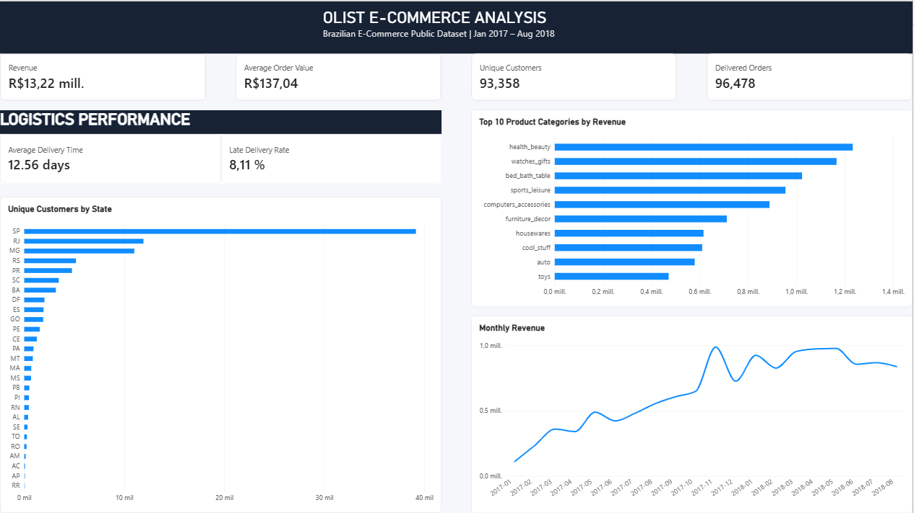

# Olist E-Commerce Analysis

End-to-end BI portfolio project using the **Brazilian E-Commerce Public Dataset by Olist**.

**Workflow:** CSV → PostgreSQL → Data Quality → Relational Modeling → SQL Analysis → Power BI → Validation

The goal was not only to build a dashboard, but to create a reproducible analytical model, investigate source-data quality, define business metrics explicitly, and validate the final Power BI results against PostgreSQL.

---

## Dashboard



**Dashboard trend window:** January 2017 – August 2018  
**Full order data coverage:** September 2016 – October 2018

### Validated KPIs

| Metric | Result |
| --- | ---: |
| Product Revenue — Delivered Orders | R$ 13,221,498.11 |
| Delivered Orders | 96,478 |
| Average Order Value | R$ 137.04 |
| Unique Customers | 93,358 |
| Average Delivery Time | 12.56 days |
| Late Delivery Rate | 8.11% |

The principal Power BI measures were validated against PostgreSQL before the dashboard was finalized.

---

## Business Questions

1. How much product revenue was generated by delivered orders?
2. How many orders were delivered?
3. What was the average order value?
4. How many unique customers purchased?
5. Which product categories and Brazilian states contributed the most?
6. How did revenue and delivery performance behave over time?

---

## Technology Stack

- **PostgreSQL 18** — database, relational modeling, constraints, data-quality checks and analysis
- **SQL** — profiling, validation, transformations and business queries
- **Power BI Desktop** — semantic model, DAX measures and dashboard
- **GitHub** — documentation and portfolio publication

---

## Dataset

The source contains nine CSV files.

| Source table | Grain / purpose |
| --- | --- |
| `customers` | Customer record associated with an order |
| `orders` | One row per order |
| `order_items` | Product/seller item within an order |
| `products` | Product attributes |
| `sellers` | Seller attributes |
| `order_payments` | Payment records associated with orders |
| `order_reviews` | Reviews associated with orders |
| `geolocation` | ZIP-level geographic observations |
| `product_category_name_translation` | Portuguese-to-English category lookup |

A key distinction discovered during profiling is that `customer_id` identifies the customer record associated with an order, while `customer_unique_id` represents the logical customer across purchases. Unique-customer metrics therefore use `customer_unique_id`.

---

## Relational Model

The main analytical path is:

```text
product_category_name_translation
              1
              |
              *
           products
              1
              |
              *
         order_items
              *
              |
              1
            orders
              |
              1
          customers
```

`orders` also relates to `order_payments` and `order_reviews`. `geolocation_clean` is used as an analytical geographic lookup.

---

## Data Quality Findings and Technical Decisions

### Customer identifiers

The `customers` table contains:

- **99,441** rows
- **99,441** distinct `customer_id` values
- **96,096** distinct `customer_unique_id` values

Therefore, `customer_id` is used for the order relationship, while `customer_unique_id` is used for unique-customer analysis.

### Review key validation

`review_id` was not globally unique. The combination below was validated as unique:

```text
(review_id, order_id)
```

It was therefore used as the composite primary key instead of assuming `review_id` alone was sufficient.

### Payments, reviews and fan-out risk

An order can contain multiple payment records. One order contained **29 payment records**.

The payment key was modeled as:

```text
(order_id, payment_sequential)
```

Reviews can also behave as one-to-many from orders.

Joining `order_items`, `order_payments` and `order_reviews` directly can therefore multiply rows and overstate aggregated values. Business queries use only the tables required at a compatible grain.

### Missing category translations

Two product categories were absent from the translation lookup:

- `portateis_cozinha_e_preparadores_de_alimentos`
- `pc_gamer`

Their Portuguese keys were added with a `NULL` English translation rather than inventing translations. This preserves referential integrity without fabricating source data.

### Geolocation cleaning

The raw geolocation table contained:

- **1,000,163** rows
- **738,332** distinct complete rows
- **261,831** redundant duplicate rows (~26.18%)
- **8,559** ZIP prefixes associated with more than one city/state combination
- **8** ZIP prefixes associated with more than one state

ZIP prefix therefore could not be used directly as a primary key.

A new analytical table, `geolocation_clean`, was created by:

1. counting city/state occurrences within each ZIP;
2. ranking them with `ROW_NUMBER()`;
3. retaining the most frequent city/state combination;
4. averaging distinct coordinate pairs to obtain representative latitude and longitude.

The resulting table contains **19,015 rows and 19,015 unique ZIP prefixes**.

Coverage remained incomplete:

- **157 customer ZIP prefixes** were absent;
- **7 seller ZIP prefixes** were absent.

For this reason, PostgreSQL foreign keys from customers and sellers to `geolocation_clean` were intentionally not enforced. Geography remains an analytical lookup so valid business records are not discarded because of incomplete geographic coverage.

### Temporal coverage

Order timestamps span:

- **Minimum:** 2016-09-04 21:15:19
- **Maximum:** 2018-10-17 17:30:18

The edge periods are irregular: 2016 is sparse, while September and October 2018 contain very few orders and are not comparable with normal full months.

The complete dataset remains available in the model, but the dashboard trend uses **January 2017 through August 2018** to avoid interpreting incomplete edge-period coverage as a genuine business trend.

---

## Business Definitions

### Revenue

For this project:

```text
Revenue = SUM(order_items.price)
          for orders where order_status = 'delivered'
```

This represents **product revenue from delivered orders**, not formal accounting revenue recognition. Freight is excluded.

### Delivered Orders

Count of orders where `order_status = 'delivered'`.

### Average Order Value

Product revenue from delivered orders divided by the number of delivered orders.

### Unique Customers

Distinct `customer_unique_id` values associated with delivered orders.

### Average Delivery Time

Average elapsed time between purchase timestamp and customer delivery timestamp for delivered orders.

### Late Delivery Rate

Percentage of delivered orders where:

```text
order_delivered_customer_date > order_estimated_delivery_date
```

---

## Main Analytical Results

### Top 10 Product Categories by Revenue

| Rank | Category | Revenue |
| ---: | --- | ---: |
| 1 | `health_beauty` | R$ 1,233,131.72 |
| 2 | `watches_gifts` | R$ 1,166,176.98 |
| 3 | `bed_bath_table` | R$ 1,023,434.76 |
| 4 | `sports_leisure` | R$ 954,852.55 |
| 5 | `computers_accessories` | R$ 888,724.61 |
| 6 | `furniture_decor` | R$ 711,927.69 |
| 7 | `housewares` | R$ 615,628.69 |
| 8 | `cool_stuff` | R$ 610,204.10 |
| 9 | `auto` | R$ 578,966.65 |
| 10 | `toys` | R$ 471,286.48 |

### Customer Geography

São Paulo (`SP`) contains the largest number of unique customers associated with delivered orders, followed by Rio de Janeiro (`RJ`) and Minas Gerais (`MG`).

State-level distinct-customer counts should not be expected to sum exactly to the global total because the same `customer_unique_id` can appear in more than one state across its records.

---

## Power BI Model

The Power BI MVP imports:

- `customers`
- `orders`
- `order_items`
- `products`
- `product_category_name_translation`
- `geolocation_clean`

A dedicated `DimDate` table was created for temporal analysis. A date-only `Purchase Date` column was derived from `order_purchase_timestamp` and related to `DimDate[Date]`.

### Core DAX Measures

#### Revenue

```DAX
Revenue =
CALCULATE(
    SUM('public order_items'[price]),
    'public orders'[order_status] = "delivered"
)
```

#### Delivered Orders

```DAX
Delivered Orders =
CALCULATE(
    COUNTROWS('public orders'),
    'public orders'[order_status] = "delivered"
)
```

#### Average Order Value

```DAX
Average Order Value =
DIVIDE(
    [Revenue],
    [Delivered Orders]
)
```

#### Unique Customers

```DAX
Unique Customers =
CALCULATE(
    DISTINCTCOUNT('public customers'[customer_unique_id]),
    'public orders'[order_status] = "delivered"
)
```

#### Average Delivery Days

```DAX
Average Delivery Days =
CALCULATE(
    AVERAGEX(
        'public orders',
        DATEDIFF(
            'public orders'[order_purchase_timestamp],
            'public orders'[order_delivered_customer_date],
            SECOND
        ) / 86400
    ),
    'public orders'[order_status] = "delivered"
)
```

#### Late Delivery Rate

```DAX
Late Delivery Rate =
DIVIDE(
    CALCULATE(
        COUNTROWS('public orders'),
        FILTER(
            'public orders',
            'public orders'[order_status] = "delivered"
                && 'public orders'[order_delivered_customer_date]
                   > 'public orders'[order_estimated_delivery_date]
        )
    ),
    [Delivered Orders]
)
```

Display-only measures were used where necessary to prevent automatic KPI abbreviation in Power BI cards. The underlying numeric measures remain unchanged for calculations.

---

## Dashboard Design

The final dashboard contains:

- four executive KPI cards;
- monthly delivered-order revenue;
- top 10 product categories by revenue;
- unique customers by Brazilian state;
- average delivery time;
- late delivery rate.

The dashboard intentionally avoids unnecessary visuals. Each component answers a defined business question.

---

## Repository Structure

```text
olist-ecommerce-analysis/
|-- README.md
|-- GITHUB_CHECKLIST.md
|-- sql/
|   |-- 01_create_tables.sql
|   |-- 02_data_quality_checks.sql
|   |-- 03_geolocation_clean.sql
|   |-- 04_constraints.sql
|   `-- 05_business_analysis.sql
|-- powerbi/
|   |-- olist_ecommerce_dashboard.pbix
|   `-- README.md
|-- images/
|   |-- dashboard.png
|   `-- README.md
`-- docs/
    |-- data_dictionary.md
    `-- linkedin_post.md
```

---

## How to Reproduce

1. Download the Olist Brazilian E-Commerce dataset from its original source.
2. Create a PostgreSQL database named `olist_ecommerce`.
3. Create the relational tables using `sql/01_create_tables.sql`.
4. Import the corresponding CSV files.
5. Run `sql/02_data_quality_checks.sql`.
6. Build `geolocation_clean` using `sql/03_geolocation_clean.sql`.
7. Apply the validated constraints with `sql/04_constraints.sql`.
8. Run the business queries in `sql/05_business_analysis.sql`.
9. Connect Power BI Desktop to PostgreSQL in **Import** mode.
10. Build the semantic model and DAX measures documented above.
11. Use January 2017 through August 2018 for the monthly trend visual.
12. Compare the Power BI KPIs against the validated SQL results.

> Raw Olist CSV files are intentionally not included in this repository.

---

## Skills Demonstrated

- Relational data modeling
- Primary, foreign and composite key validation
- Data-quality profiling
- SQL joins and aggregation
- Grain awareness
- Prevention of fan-out errors
- Window functions with `ROW_NUMBER()`
- CTE-based transformations
- Business metric definition
- Temporal-data validation
- PostgreSQL-to-Power BI integration
- DAX measures and filter context
- Cross-tool result validation
- Technical documentation

---

## Key Takeaway

Dashboard development begins before Power BI.

Several apparently reasonable assumptions — unique review IDs, unique ZIP codes, complete translation coverage, one-to-one payment behavior and uniform temporal coverage — did not hold when tested.

Profiling and modeling these issues in PostgreSQL first produced a cleaner and more defensible analytical layer, while making the final Power BI results easier to validate, reproduce and explain.
